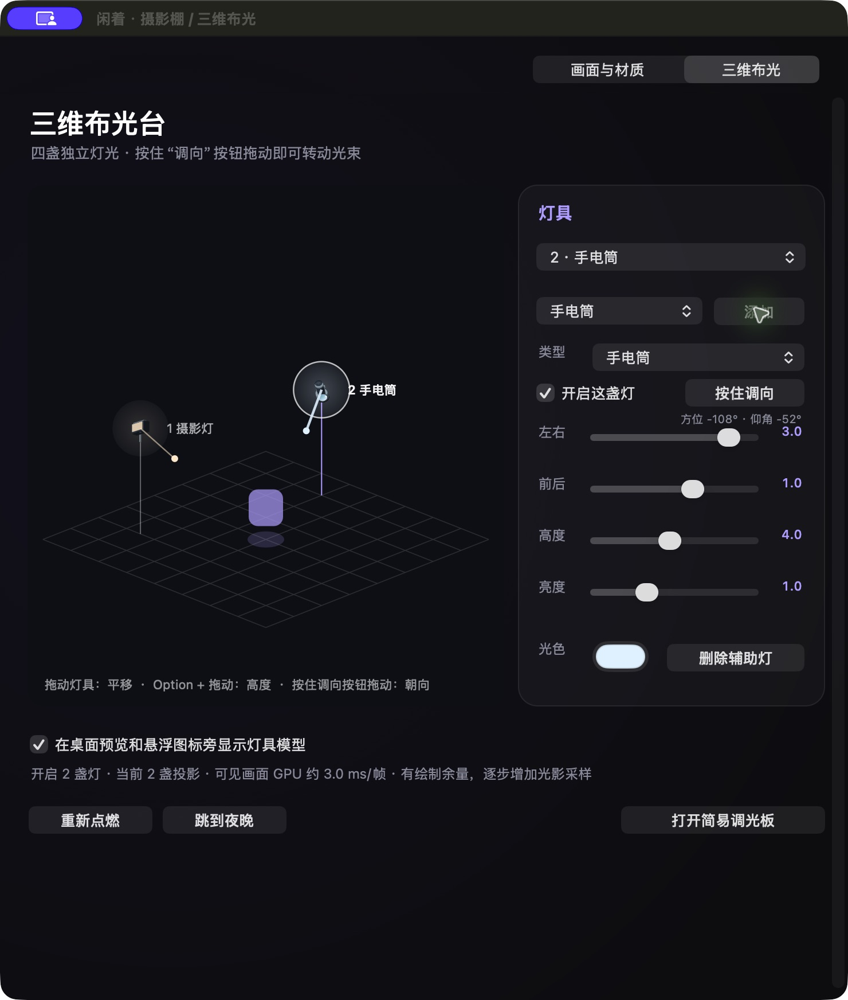

# 闲着 · Xianzhe 1.0

“闲着”是一款原生 macOS 桌面光影玩具：它把当前使用的应用图标抠成有厚度的旋转物体，在模拟桌面和真实桌面上绘制灯光与阴影。



## 玩什么

- 在模拟桌面拖动图标位置，调整大小、转速、抠图、材质、厚度与颜色。
- 在摄影棚内切换“画面与材质 / 三维布光”，最多放四盏灯。拖动灯具改变位置，按住 Option 拖动改变高度；每盏灯可单独调亮度和颜色。
- 手电筒和摄影灯有方向。按住“调向”按钮拖动，灯具朝向、照明范围和影子一起改变。手电筒、蜡烛等是几何模型，不是 emoji 贴图。
- 蜡烛会闪烁、逐渐变短并燃尽；火柴更快燃尽，可重新点燃。太阳在四分钟的**演示周期**中东升西落，夜间换成较暗的月亮。这是玩具时间，不是现实天文时间。
- 桌面悬浮图标与摄影棚同步。自动画质会依据绘制耗时、内存压力、温度和低电量状态退让；硬件支持且只有一盏灯时可使用 Metal 光线求交计算影子。
- 应用显示在程序坞，也保留菜单栏入口。内容展厅已从 1.0 删除。

## 下载与运行

从 [v1.0.0 发布页](https://github.com/zhuangli410-commits/xianzhe/releases/tag/v1.0.0)下载 ZIP，解压后打开“闲着.app”。本地构建需 macOS 和 Xcode Command Line Tools：

```sh
./outputs/IdleIcon/build.sh
open outputs/闲着.app
```

目标为 Apple Silicon（arm64）、macOS 14 及以上。本机在 Apple M5 / 32 GiB 上做了短时功能与 GPU 检查；其他机型、长时间使用、多显示器和真实睡眠尚未验证。应用只有本地临时签名，未做 Apple 开发者签名与公证；在其他 Mac 上安装可能受到系统安全检查限制。

## 当前边界

光源行为是适合观看的实时近似，不是完整路径追踪或天文模拟。桌面影子落在软件自己的虚拟承影面上，不读取其他应用窗口的三维形状。删除内容展厅后，1.0 **没有主动填满空余内存的玩法**；“尽可能利用闲置内存”仍是后续目标，不能把当前 GPU 绘制或旧版内存实验说成已实现几十 GB 的物理内存占用。

## 开发与检查

```sh
./outputs/IdleIcon/test.sh
./outputs/IdleIcon/test-appearance.sh
./outputs/IdleIcon/test-performance.sh
./outputs/IdleIcon/test-ray.sh
```

检查记录见[开发进度](outputs/开发进度.md)与[测试记录](outputs/IdleIcon/测试记录.md)。[第一版操作手册](outputs/第一版开发操作手册.md)保留需求与阶段边界；本机可用 `outputs/打开逐项批注.command` 打开分区批注页，批注只写到本机，不在 GitHub 发布。
