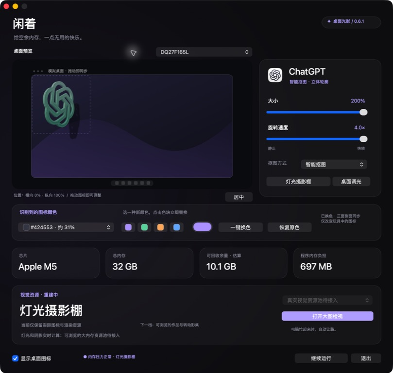
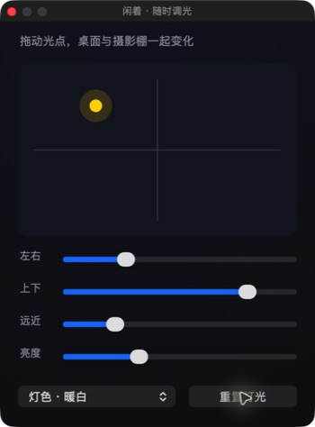

# 闲着 · Xianzhe

一个原生 macOS 桌面玩具：把当前应用的图标变成立体旋转物体，用空闲性能玩灯光、材质和阴影。

当前版本 **0.6.1 · 桌面光影与随时调光**。

[下载预览版](https://github.com/zhuangli410-commits/xianzhe/releases/tag/v0.6.1) · [使用说明](outputs/IdleIcon/README.md) · [开发进度](outputs/开发进度.md)

## 已有功能

- 跟随当前应用，按图标轮廓生成有厚度的物体，保留孔洞。
- 透明桌面悬浮与实时投影，鼠标可穿透；模拟桌面拖动位置、调整大小和速度。
- 哑光、陶瓷、金属，以及图标配色和厚度调整。
- 随时打开悬浮调光板，拖动光点或调整左右、上下、远近、亮度、灯色。
- 日常／尽兴／手动上限，依据绘制耗时和系统压力调整画质。





## 下载与兼容性

从 Releases 下载 ZIP，解压后打开“闲着.app”。完整包同时包含源代码和开发文档。

- 实测：Apple M5 / 32 GiB / macOS 26.6.2。
- 构建目标：Apple Silicon（arm64）、macOS 14+；其他机器和系统版本尚未验证。
- 目前仅本地临时签名，未做 Apple 开发者签名与公证，其他机器可能受到系统安全检查限制。也可使用源码在本机构建。

## 本机构建

需要 macOS 和 Xcode Command Line Tools。先退出已运行的“闲着”，在仓库根目录执行：

```sh
./outputs/IdleIcon/build.sh
open outputs/闲着.app
```

构建产物在 `outputs/闲着.app`，临时文件在 `work/`。项目使用 Swift、AppKit 和 Metal，无第三方包依赖。

检查入口：

```sh
./outputs/IdleIcon/test.sh
./outputs/IdleIcon/test-appearance.sh
./outputs/IdleIcon/test-performance.sh
```

外观检查需要可用的 Metal 设备和 macOS 图形会话。`test-memory.sh` 是旧内存方案的历史实验入口，不代表本版产品功能。

## 当前边界

本版使用阴影贴图，不是光追；桌面投影来自软件自己的虚拟承影面，不读取其他应用窗口的三维形状。

可浏览的大内存作品资源池和光追尚未实现；旧随机填充已停用。主动利用闲置内存仍是后续目标，不承诺占满固定比例或完全不影响日常使用。长期日常体验、真实睡眠、多显示器和跨机型检查尚未完成。

## 开发记录

- [第一版开发操作手册](outputs/第一版开发操作手册.md)
- [当前状态与验证边界](outputs/开发进度.md)
- [桌面光影实现计划](outputs/0.6.1桌面光影计划.md)
- [测试记录](outputs/IdleIcon/测试记录.md)

仓库保留测试结论和检查入口；本机临时日志、历史安装包与回退副本不提交。
